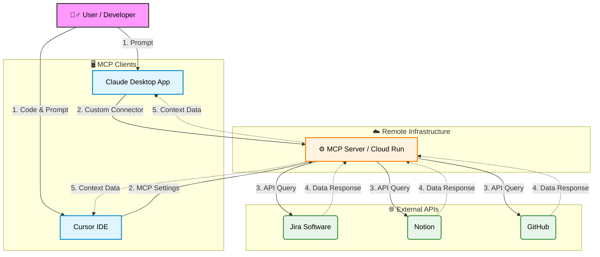

# 🤖 Workplace Automation AI Agent with MCP

### Jira, Notion, GitHub 워크플로우 통합 자동화 프로젝트

> **한 줄 요약:** 사내 협업 툴(Jira, Notion, GitHub)의 데이터를 **표준 MCP 프로토콜**로 통합하여, **Claude Desktop**뿐만 아니라 **Cursor IDE** 등 다양한 환경에서 업무를 자동화하는 AI Agent 시스템입니다.

---

## 🧐 프로젝트 배경 (Motivation)

개발 업무 중 발생하는 반복적인 컨텍스트 스위칭을 줄이기 위해 시작했습니다. 특히 기획자/PM과는 **Claude**로 소통하고, 개발 팀원들은 **Cursor IDE**에서 코드를 작성하는 환경을 고려하여, **어떤 인터페이스에서도 동일한 맥락(Context)을 공유할 수 있는 표준화된 Agent**가 필요했습니다.

이를 위해 LLM과 외부 시스템 간의 표준 프로토콜인 **MCP(Model Context Protocol)**를 도입하여 유연하고 확장 가능한 아키텍처를 구현했습니다.

## 🎯 주요 기능 (Features)

* **Multi-Client Support:** Claude Desktop 앱과 Cursor IDE 양쪽에서 동일한 툴 제어 가능.
* **Jira 이슈 핸들링:** "이번 주 내 티켓 리스트 뽑아줘" 등의 명령으로 실시간 이슈 트래킹.
* **Notion 문서화:** 개발 진행 상황을 바탕으로 주간 업무 보고서 및 회의록 자동 생성.
* **GitHub 연동:** IDE(Cursor) 내에서 곧바로 PR 상태 확인 및 코드 리뷰 요약 요청.

## 🏗️ 시스템 아키텍처 (Architecture)

Cloud Run에 배포된 단일 MCP 서버가 여러 클라이언트(Claude, Cursor)의 요청을 처리하는 중앙 집중형 구조입니다.

### 기술 스택 (Tech Stack)

* **Clients:** Claude Desktop App, Cursor IDE
* **Protocol:** Model Context Protocol (MCP) over SSE (Server-Sent Events)
* **Backend:** Google Cloud Run (Node.js/TypeScript)
* **Integrations:** Jira, Notion, GitHub APIs

## 🛠️ 클라이언트 연결 방법 (How to Connect)

이 프로젝트는 별도의 로컬 설치 없이, 배포된 MCP 서버 URL만으로 연결이 가능합니다.

### 1. Claude Desktop App 연결

설정 파일(`json`)을 직접 수정하지 않고, 최신 UI 기능을 활용합니다.

1. **Settings** 메뉴 진입.
2. **Developer** (또는 Connections) 탭 클릭.
3. **Edit Config** 대신 **`Add Custom Connector`** (또는 Remote MCP Server) 버튼 클릭.
4. URL 입력창에 배포된 MCP 서버 엔드포인트 입력 (예: `https://.../mcp`).
5. 연결 상태가 녹색(Connected)으로 변하는지 확인.

### 2. Cursor IDE 연결

개발 팀원들은 코드를 작성하며 바로 Agent를 호출할 수 있습니다.

1. **Cursor Settings** (`Cmd + ,` or `Ctrl + ,`) 진입.
2. **General > MCP Servers** 메뉴로 이동.
3. **`Add new MCP server`** 클릭.
4. **Type:** `SSE` 선택.
5. **URL:** 배포된 MCP 서버 엔드포인트 입력.
6. 저장 후 Composer(`Cmd + I`)나 Chat(`Cmd + L`)에서 `@`를 눌러 도구 연동 확인.

## 💡 트러블 슈팅 (Troubleshooting Log)

**이슈: `claude_desktop_config.json`을 통한 원격 연결 실패**

* **현상:** 초기 개발 시 로컬 설정 파일(`json`)에 원격 URL을 직접 입력했으나, Claude Desktop이 제대로 인식하지 못하거나 연결이 불안정한 현상 발생.
* **원인:** 로컬 설정 파일 방식은 주로 로컬 프로세스 실행(`npx ...`)에 최적화되어 있어, 원격 SSE 스트림 처리에 일부 제약이 있었음.
* **해결:** Claude Desktop의 설정 파일 직접 수정 방식을 버리고, 앱 내에서 제공하는 **'Custom Connector' UI**를 통해 엔드포인트를 등록하는 방식으로 변경하여 즉시 해결. 이를 통해 프록시 서버 등 불필요한 미들웨어 없이 직관적인 연결에 성공함.
