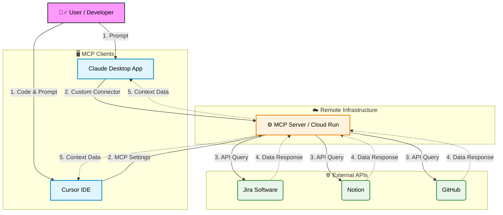

# 🤖 Workplace Automation AI Agent with MCP

### Jira, Notion, GitHub 워크플로우 통합 자동화 프로젝트

> **한 줄 요약:** 사내 협업 툴(Jira, Notion, GitHub)의 데이터를 **표준 MCP 프로토콜**로 통합하여, **Claude Desktop**뿐만 아니라 **Cursor IDE** 등 다양한 환경에서 업무를 자동화하는 AI Agent 시스템입니다.

---

## 🧐 프로젝트 배경 (Motivation)

개발 업무 중 발생하는 반복적인 컨텍스트 스위칭을 줄이기 위해 시작했습니다. 특히 기획자/PM과는 **Claude**로 소통하고, 개발 팀원들은 **Cursor IDE**에서 코드를 작성하는 환경을 고려하여, **어떤 인터페이스에서도 동일한 맥락(Context)을 공유할 수 있는 표준화된 Agent**가 필요했습니다.

이를 위해 LLM과 외부 시스템 간의 표준 프로토콜인 **MCP(Model Context Protocol)** 를 도입하여 유연하고 확장 가능한 아키텍처를 구현했습니다.

## 🎯 주요 기능 (Features)

* **Multi-Client Support:** Claude Desktop 앱과 Cursor IDE 양쪽에서 동일한 툴 제어 가능.
* **중앙 토큰 관리:** 원격 MCP 서버를 사용하므로 토큰을 서버 한 곳에서만 관리하면 되어, 클라이언트별로 토큰을 넣을 필요가 없고 관리가 편함.
* **팀 온보딩 간소화:** 같은 MCP 서버를 쓰는 팀원들이 각자 로컬 MCP 서버를 세팅하고 토큰을 따로 발급받는 반복적·비효율적인 작업을 하지 않아도 됨.
* **Jira 이슈 핸들링:** "이번 주 내 티켓 리스트 뽑아줘" 등의 명령으로 실시간 이슈 트래킹.
* **Notion 문서화:** 개발 진행 상황을 바탕으로 주간 업무 보고서 및 회의록 자동 생성.
* **GitHub 연동:** IDE(Cursor) 내에서 곧바로 PR 상태 확인 및 코드 리뷰 요약 요청.

> **📋 업무 자동화 예시 - 주간 업무 보고서 작성**
> 
> 📁 **프롬프트 파일:** [`prompts/weekly_report.md`](prompts/weekly_report.md)
> 
> MCP 서버를 활용하여 지난 7일간의 업무 내역을 자동으로 수집하고 분석하여 주간 업무 보고서를 생성합니다.
> 
> **수집하는 정보:**
> - **Jira:** 내가 할당받은 티켓, 댓글, 상태 변경 이력
> - **GitHub:** 내가 작성한 PR, 커밋, 코드 리뷰 코멘트
> - **Notion:** 내가 수정/생성한 페이지, 팀 문서, 개인 노트
> 
> **작동 방식:**
> 1. 각 플랫폼에서 최근 활동을 수집
> 2. 발견된 링크와 참조를 재귀적으로 추적하여 맥락 확장 (예: PR 본문의 Jira 티켓 번호 → Jira 상세 정보 조회)
> 3. 관련 정보를 프로젝트/태스크 단위로 그룹화하여 통합 분석
> 
> **생성되는 출력:**
> - 핵심 성과 요약 (Executive Summary)
> - 상세 업무 내역 (배경, 구현 내용, 트러블 슈팅 포함)
> - 코드 리뷰 및 협업 내역
> - 특이사항 및 블로커
> - **자동으로 Notion 페이지에 저장**
> 


## 🏗️ 시스템 아키텍처 (Architecture)

Cloud Run에 배포된 단일 MCP 서버가 여러 클라이언트(Claude, Cursor)의 요청을 처리하는 중앙 집중형 구조입니다.



### 기술 스택 (Tech Stack)

* **Clients:** Claude Desktop App, Cursor IDE
* **Protocol:** Model Context Protocol (MCP)
* **Backend:** Google Cloud Run (Node.js/TypeScript)
* **Integrations:** Jira, Notion, GitHub APIs

## 🛠️ 클라이언트 연결 방법 (How to Connect)

이 프로젝트는 별도의 로컬 설치 없이, 배포된 MCP 서버 URL만으로 연결이 가능합니다.

### 1. Claude Desktop App 연결

설정 파일(`json`)을 직접 수정하지 않고, 최신 UI 기능을 활용합니다.

1. **Settings** 메뉴 진입.
2. **Developer** (또는 Connections) 탭 클릭.
3. **Edit Config** 대신 **`Add Custom Connector`** (또는 Remote MCP Server) 버튼 클릭.
4. URL 입력창에 배포된 MCP 서버 엔드포인트 입력 (예: `https://.../mcp`).
5. 연결 상태가 녹색(Connected)으로 변하는지 확인.

### 2. Cursor IDE 연결

Cursor IDE의 MCP 서버 설정 파일(`mcp.json`)을 직접 수정하여 연결할 수 있습니다.

**설정 파일 위치:**
- macOS: `~/Library/Application Support/Cursor/User/globalStorage/mcp.json`
- Windows: `%APPDATA%\Cursor\User\globalStorage\mcp.json`
- Linux: `~/.config/Cursor/User/globalStorage/mcp.json`

**설정 예시 (`mcp.json`):**

```json
{
  "mcpServers": {
    "github": {
      "url": "https://your-github-mcp-server.run.app/mcp"
    },
    "notion": {
      "url": "https://your-notion-mcp-server.run.app/mcp"
    },
    "jira": {
      "url": "https://your-jira-mcp-server.run.app/mcp"
    }
  }
}
```

설정 후 Cursor IDE를 재시작하거나, Composer(`Cmd + I`)나 Chat(`Cmd + L`)에서 `@`를 눌러 도구 연동을 확인합니다.

## 🚀 배포 작업 내역 (Deployment Work)

### 1. GitHub MCP 서버 배포

#### 코드 수정 사항

**서버 단일 토큰 모드 구현:**
- **목적:** 클라이언트가 URL만 설정하고 토큰 없이 연결 가능하도록 서버에 토큰을 미리 설정하는 모드 구현
- **변경 파일:**
  - `pkg/http/server.go`: `ServerConfig` 구조체에 `ServerManagedToken` 필드 추가
  - `pkg/http/middleware/token.go`: `ExtractUserToken` 미들웨어에 서버 토큰 사용 로직 추가
    - 클라이언트가 `Authorization` 헤더를 보내지 않으면 서버에 설정된 토큰 사용
    - 토큰 타입 자동 감지 (`TokenTypeFromToken` 함수 추가)
  - `pkg/utils/token.go`: 토큰 문자열로부터 `TokenType`을 반환하는 `TokenTypeFromToken` 함수 추가
  - `cmd/github-mcp-server/main.go`: `httpConfig`에 `ServerManagedToken: viper.GetString("personal_access_token")` 설정 추가
  - `pkg/http/handler.go`: `ExtractUserToken` 호출 시 서버 토큰 전달

**동작 방식:**
- 환경변수 `GITHUB_PERSONAL_ACCESS_TOKEN`이 설정되면 서버가 자동으로 해당 토큰 사용
- 클라이언트가 `Authorization` 헤더를 보내면 클라이언트 토큰 우선 사용 (기존 동작 유지)
- 클라이언트가 토큰 없이 요청하면 서버 토큰으로 자동 인증

#### Dockerfile 수정

- **변경:** `CMD ["stdio"]` → `CMD ["http"]`
- **이유:** Cloud Run에서 HTTP 모드로 실행하기 위해 기본 커맨드를 변경

---

### 2. Notion & Jira MCP 서버 배포

Notion과 Jira MCP 서버는 오픈소스 MCP 서버를 사용하여 배포했습니다.

**오픈소스 레포지토리:**
- **Notion MCP Server:** [makenotion/notion-mcp-server](https://github.com/makenotion/notion-mcp-server)
- **Jira MCP Server:** [atlassian/atlassian-mcp-server](https://github.com/sooperset/mcp-atlassian)

---

### 공통 배포 설정

**모든 MCP 서버:**
- Cloud Run에 배포
- 엔드포인트: `{BASE_URL}/mcp`
- 헬스체크: 각 서버별 헬스체크 엔드포인트 제공 (Notion: `/health`, GitHub: `/mcp` 등)

**테스트 스크립트:**
- `scripts/mcp-test-all.sh`: 모든 서버에 대해 헬스체크, 세션 테스트, 부하 테스트, 동시성 테스트 수행
- `scripts/mcp-servers.conf`: 서버 목록 및 포트 설정 (동적 포트 할당 지원)
